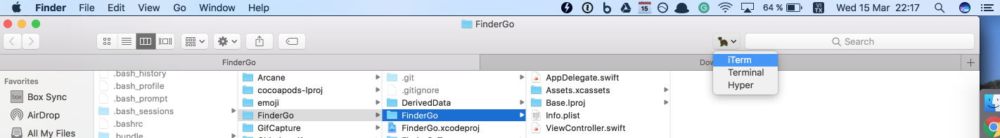
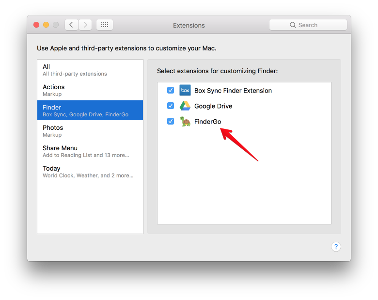
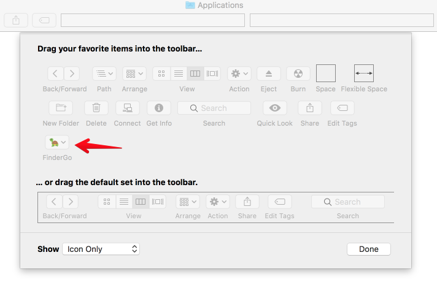

# 𝗙𝗶𝗻𝗱𝗲𝗿 𝗚𝗼

<div align = "center">

<br>
<br>
</div>

## Description

- A macOS app and Finder Sync Extension to open Terminal, iTerm, Hyper from Finder
- Support macOS 10.12

## How to install

- Get the binary from https://github.com/onmyway133/FinderGo/releases

## How to use


### As a macOS application

- Support `iTerm` for now

#### How to use
- Right click on app to open, because this is not from AppStore
- Cmd+Drag app icon into Finder toolbar

#### How to change default terminal

Run either of these to change your default terminal that FinderGo uses

```
defaults write com.onmyway133.FinderGo terminal Terminal
defaults write com.onmyway133.FinderGo terminal iTerm
defaults write com.onmyway133.FinderGo terminal Hyper
```

### As a Finder Sync Extension

- [x] Go to Terminal
- [x] Go to iTerm
- [x] Go to Hyper

<div align = "center">

<br>
<br>
</div>

#### How to use

- Because of sandbox, we need to copy scripts from `FinderSyncExtension/Scripts` in project to `/Library/Application Scripts/com.onmyway133.FinderGo.FinderSyncExtension` by running 

```sh
curl -fsSL https://raw.githubusercontent.com/onmyway133/FinderGo/master/install.sh | sh
```

- Check for `System Preferences` -> `Extensions` -> `Finder` to enable `FinderGo` if it is not enabled yet



- Right click on Finder toolbar -> `Customize Toolbar`, then Cmd+Drag `FinderGo` onto toolbar



## Credit

- Icon http://emojione.com/

## Author

Khoa Pham, onmyway133@gmail.com

## License

**FinderGo** is available under the MIT license. See the [LICENSE](https://github.com/onmyway133/FinderGo/blob/master/LICENSE.md) file for more info.
