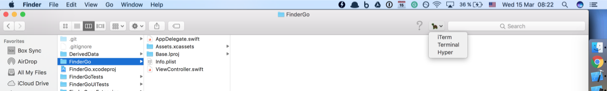

# FinderGo

 
 

 
 

# Description

- A Finder Sync Extension on your toolbar to open terminal quickly
- Icon http://emojione.com/

# Features

- [x] Go to Terminal
- [x] Go to iTerm
- [x] Go to Hyper

# How to use

- Get the binary from https://github.com/onmyway133/FinderGo/releases

## Author

Khoa Pham, onmyway133@gmail.com

## License

**FinderGo** is available under the MIT license. See the [LICENSE](https://github.com/onmyway133/FinderGo/blob/master/LICENSE.md) file for more info.
